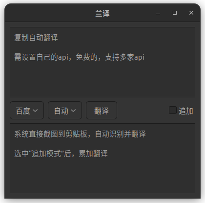
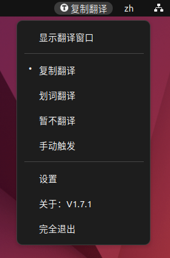
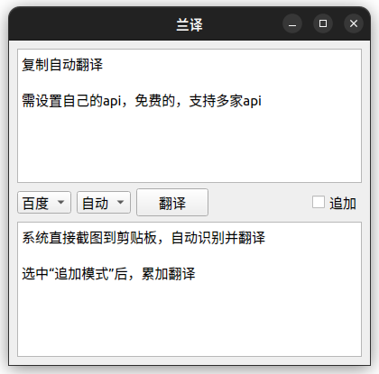
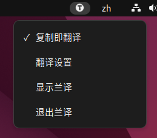
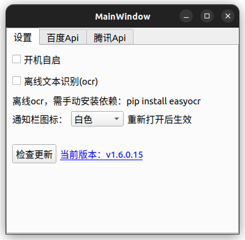

!! 项目已经重构，后续将不再更新此项目

> 目前仅在 `archlinux最新版` `gnome桌面` 测试！！

新项目见：[lfy](https://github.com/yuhldr/lfy)，欢迎贡献代码

# 兰译 

 一个翻译软件，使用Gtk3开发（最近开发了QT版本），python语言，翻译用的百度、腾讯接口

## 特点

- 界面美观、依赖少，可 `复制翻译`、`划词翻译`，小白也能用
- 优先支持 `ubuntu`、`archlinux`，含 `gnome` 和 `kde` 两种桌面环境（其他系统理论上也能用）
- 支持 `百度` `腾讯` 两个翻译平台

|版本|翻译页面|状态栏菜单|设置
|:-:|:-:|:-:|:-:|
gtk版本|||
qt版本|||

## 安装

[看这里](md/install.md)

## 常见问题

[看这里](md/qa.md)

## 使用说明

[看这里](md/feature.md)

## 其他

[开发资料看这里](md/other.md)

> 希望一起完善 snap 打包和 ppa 发布，可联系 yuhldr@qq.com

- snap打包，一直失败，如果您熟悉snap，希望一起完善
- ppa 发布，我设置了，但是不熟悉，目前未能完成

## Sponsor
The project is develop by [JetBrains Ide](https://www.jetbrains.com/?from=puck)

