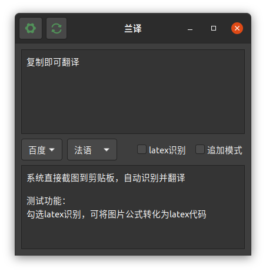
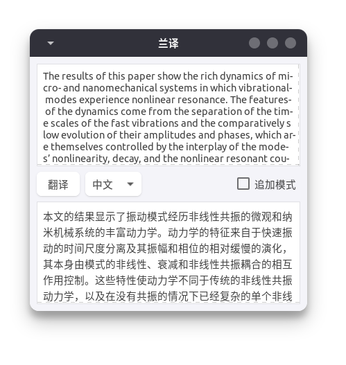
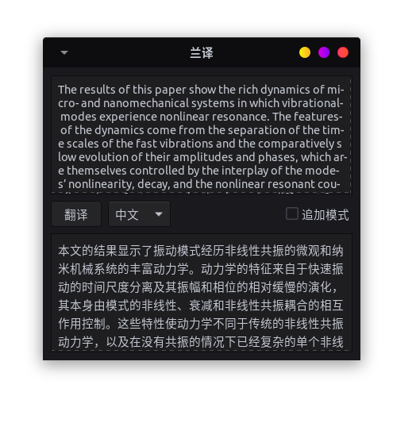
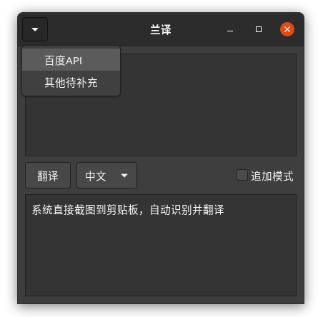
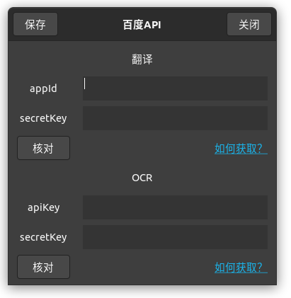
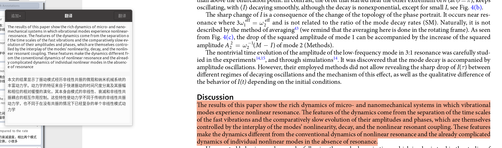
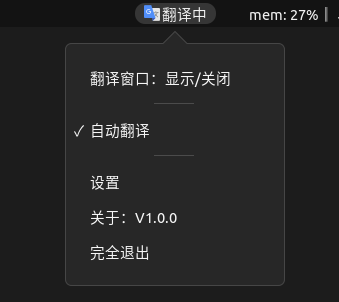

# 兰译

 
一个ubuntu的翻译软件，使用Gtk3开发，python语言，翻译用的百度接口

已打包deb，经测试ubuntu2004可以安装其他暂未测试

- 复制文本自动翻译(可划词翻译)
- 可选追加复制
- 可修改复制内容，重新翻译
- 截图自动识别、并翻译
- 多语言互译支持，自动识别当前语言
- 设置中自定义接口账号
- （待完善）支持多平台api接口，目前仅支持百度api，足够了……
- 页面随着系统主题（gnome）自动变化

|系统默认主题 yaru-dark|第三方主题layan|第三方主题kimi-dark|
|:-:|:-:|:-:|
||

## 账号

翻译页面左上角，可以设置百度的翻译API以及图片识别API，默认账号用的人太多，容易报错

|设置|百度api设置|
|:-:|:-:|
||

## 安装

```sh
sudo dpkg -i ./*.deb

# 如果报错，输入下面的
sudo apt install -f
sudo dpkg -i ./*.deb
```

运行以后，弹出翻译窗口，自动置顶窗口，5大功能

1. 自动翻译
  
    复制时自动翻译。如需划词翻译，[config.json](./config.json) 里修改 `"translate_way_copy": false,`，不建议划词翻译，有时候有问题

    

2. 图片翻译
  
    截图到系统剪贴板，会自动识别并翻译，为了方便将ubuntu2004系统设置的快捷键，修改为一个自己习惯的。

    

3. 窗口置顶

    复制时自动弹出窗口，并置顶，可常驻后台，可暂停翻译

    

4. 修改编辑

    可以修改复制或者OCR的内容，然后点击右上角重新翻译

5. 追加模式

    有时候一句话在文献里分成上下两页，复制半句翻译有问题，这时候勾选 `追加模式`，接下来复制的内容，会和前一次的复制内容，一起翻译

或者直接找到 `兰译` 图标
 ，点击即可运行

> 偶尔需要注销当前用户重新登录，才可以看到图标，不懂什么意思的话，直接重启……

### 卸载

```bash
sudo apt remove ldr-translate -y
```

## 资料

- [Python Gtk+3 API &#xB7; Python GTK+ 3 API](https://athenajc.gitbooks.io/python-gtk-3-api/content/)

- [Welcome to big-doc’s documentation! &mdash; big-doc 0.1 documentation](https://thebigdoc.readthedocs.io/en/latest/index.html)

- [The Python GTK+ 3 Tutorial &mdash; Python GTK+ 3 Tutorial 3.4 documentation](https://python-gtk-3-tutorial.readthedocs.io/en/latest/index.html)

## 开发工具

- 功能开发：vscode
- ui开发：glade
