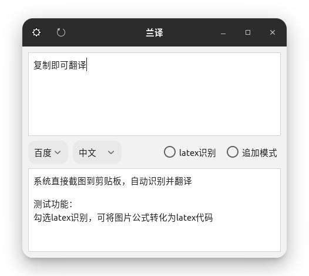
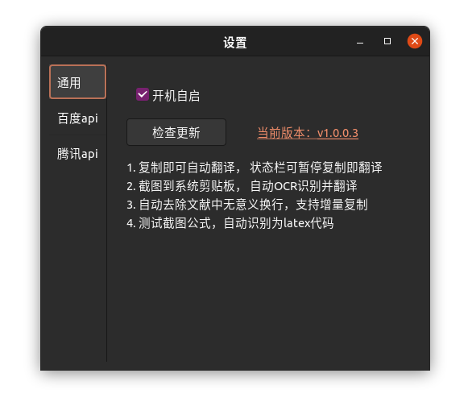

# 兰译

 
一个翻译软件，顺带可以查看GPU等信息，使用Gtk3开发（最近开发了QT版本比较简洁，测试中），python语言，翻译用的百度、腾讯接口

## 安装

- [点我安装deb版本](#安装deb版本): ubuntu等使用gnome桌面的，建议[gtk版本](#gtk版本)，功能较为完善，包括GPU、CPU、内存等信息使用情况，已经打包deb安装包:
- [点我安装QT版本](#安装QT版本): opensuse等kde桌面的，建议[qt版本](#qt版本)，测试中，功能暂时不完善，基本上只能翻译(含截图翻译、追加模式、自定义百度api)，KDE自带系统信息小部件，暂时不会开发 `GPU、CPU、内存等信息使用情况` 的功能:
- archlinux系统：已经发布在aur，可以使用 `yay ldr-translate` 根据自己的桌面选择合适的即可，`kde` 桌面选择`ldr-translate-qt`，`gnome` 桌面选择`ldr-translate-gtk`

### GTk版本

建议gnome等桌面使用这个

> 已打包deb，真实环境安装（非最小安装）ubuntu20.04桌面版，虚拟机测试ubuntu22.04、ubuntu18.04、16.04, popOs,mint-linux，都可以正常使用该软件

#### GTk功能

- 复制文本自动翻译(可划词翻译)；复制兰译中的文本，不会自动翻译
- 截图自动识别、并翻译
- 可选追加复制、可自动去除文献中无意义的换行
- 可修改复制内容，重新翻译
- 多语言互译支持，自动识别当前语言
- 设置中自定义接口账号
- （完善中）支持多平台api接口，目前仅支持百度、腾讯、谷歌api，足够了……
- （测试中）截图公式，自动识别为latex代码，目前使用百度接口，效果不太好
- 页面随着系统主题（gnome）自动变化
- 可在菜单栏显示网络等系统信息

|系统默认主题 yaru-dark|第三方主题|
|:-:|:-:|
|

#### 安装deb版本

> 此为稳定版，测试功能请手动编译，很简单

在 releases下载`.deb` 的安装包，只有40+k

- [gitee 国内](https://gitee.com/yuhldr/ldr-translate/releases)
- [github 国外](https://github.com/yuhldr/ldr-translate/releases/)

然后在下载目录，右键，终端打开，终端输入如下：

```sh
sudo dpkg -i ./下载的deb文件名

# 如果报错，输入下面的
# 因为此软件依赖：gir1.2-appindicator3-0.1
# https://packages.debian.org/buster/gir1.2-appindicator3-0.1

sudo apt install -f

# 再安装
sudo dpkg -i ./下载的deb文件名

# 终端输入 ldr 或直接点击“兰译”图标即可运行
# 如果翻译过程中出现错误，请安装python3依赖库requests（目前测试无需安装）
```

> 卸载

```bash
sudo apt remove ldr-translate -y
```

#### 手动编译安装

一些新功能，平时不会发布deb，还在测试，只有自己编译才能使用

以ubuntu为例

```bash
sudo apt install cmake

make deb
```

安装包在 `build/deb` 这里

### 安装QT版本

KDE等桌面建议使用这个，还没打包，但是也容易用

以opensuse为例，下载源码，解压，打开终端，进入解压以后的文件夹

```bash
# 安装编译软件
sudo zypper in cmake

# 安装依赖并安装
make check-qt && make qt && make install
```

### 系统

#### arch打包

其实是 `aur` ，有两个版本，一个 `kde` 版本，一个 `gnome` 版本，如果你用的是 `yay`

```bash
yay ldr-translate
```

然后选择适合自己桌面的版本：`gnome` 和 `kde`

## 其他

> 希望一起完善 snap 打包和 ppa 发布，可联系 yuhldr@qq.com

- snap打包，一直失败，如果您熟悉snap，希望一起完善
- ppa 发布，我设置了，但是不熟悉，目前未能完成

## 设置

可以检查更新，可以开机自启，可以设置自己的百度腾讯api



## 功能

运行以后，弹出翻译窗口，自动置顶窗口，5大功能

1. 自动翻译

    复制时自动翻译。gtk版本支持划词翻译（仅x11窗口，gnome如ubuntu登录输入密码时，右下角请选择xorg），不建议划词翻译，有时候有问题

    

2. 图片翻译

    截图到系统剪贴板，会自动识别并翻译，为了方便将ubuntu2004系统设置的快捷键，修改为一个自己习惯的。

    

3. 窗口置顶

    复制时自动弹出窗口，并置顶，可常驻后台，可暂停翻译

    

4. 修改编辑

    可以修改复制或者OCR的内容，然后点击左上角刷新按钮，重新翻译

5. 追加模式

    有时候一句话在文献里分成上下两页，复制半句翻译有问题，这时候勾选 `追加模式`，接下来复制的内容，会和前一次的复制内容，一起翻译


## 已知问题

- qt版本，使用fcitx输入法的用户，无法输入中文

    以 `archlinux-2022-05-25` 为例，当前python为 `python3.10`

    ```bash
    ln -s /usr/lib/qt/plugins/platforminputcontexts/libfcitxplatforminputcontextplugin.so ~/.local/lib/python3.10/site-packages/PyQt5/Qt5/plugins/platforminputcontexts/
    ```

    重新打开兰朵儿即可

- ubuntu22.04复制以后，鼠标移动到兰译，才能翻译

    请不要使用wayland方式登录，登录输入密码前，右下角，选择 `xorg`

- 部分系统,安装以后找不到图标

    点键盘 window图标,然后在系统搜索里,输入ldr,即可看到"兰译"

## 资料

- [indicator-sysmonitor](https://github.com/fossfreedom/indicator-sysmonitor)

- [Python Gtk+3 API &#xB7; Python GTK+ 3 API](https://athenajc.gitbooks.io/python-gtk-3-api/content/)

- [Welcome to big-doc’s documentation! &mdash; big-doc 0.1 documentation](https://thebigdoc.readthedocs.io/en/latest/index.html)

- [The Python GTK+ 3 Tutorial &mdash; Python GTK+ 3 Tutorial 3.4 documentation](https://python-gtk-3-tutorial.readthedocs.io/en/latest/index.html)
- [linux下deb包的管理及制作 | 一次成功 - Marathon-Davis - 博客园](https://www.cnblogs.com/davis12/p/14365981.html)
- [iconfont-阿里巴巴矢量图标库](https://www.iconfont.cn/)
- [ArchLinux aur打包简易指南](https://segmentfault.com/a/1190000010991745)

## 开发工具

- 功能开发：vscode
- ui开发：glade
- deb打包方法：见 Makefile: `make build`

  - control，用了记录软件标识，版本号，平台，依赖信息等数据，这是最主要的文件配置，必不可少；
  - preinst，在解包data.tar.gz 前运行的脚本；
  - postinst，在解包数据后运行的脚本；
  - prerm，卸载时，在删除文件之前运行的脚本；
  - postrm，在删除文件之后运行的脚本；在 Cydia 系统中，Cydia 的作者 Saurik 另外- 添加了一个脚本，extrainst_，作用与 postinst 类似。
  - copyright文件: 不用说，版权信息，相当重要
  - changelog文件: 这是一个必需文件(ppa必须，此处打包不需要)，包含软件版本号，修订号，发行版和优先级。
  - rules文件: 这实际上是另外一个Makefile脚本，用来给dpkg-buildpackage用的.
  - compat文件: 这个文件留着是有用的
  - dirs文件：这个文件指出我们需要的但是在缺省情况下不会自动创建的目录
