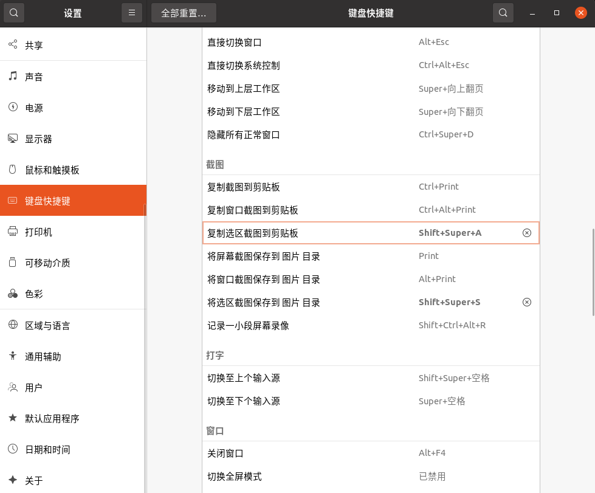

# 功能

## 设置api

- `有道`：可以直接用，但是不稳定：
- `谷歌`：需要代理，请见 [常见问题](qa.md)
- `百度`：免费申请，填写api，[申请方式参见这里](https://doc.tern.1c7.me/zh/folder/setting/#百度)
- `腾讯`：免费申请，填写api，[申请方式参见这里](https://doc.tern.1c7.me/zh/folder/setting/#腾讯云)

## 常规设置

- 点击通知栏 `设置` 可以检查更新，可以开机自启，可以设置自己的百度腾讯api

- 通知栏图标颜色，设置中可以修改，但是重新打开才生效

|gtk|qt
|:-:|:-:|
|

## 自动翻译

- 复制时自动翻译并弹出窗口。
- gtk版本支持划词翻译（仅x11窗口，gnome如 `ubuntu22.04` 注销重新登录输入密码时，右下角请选择xorg），不建议划词翻译，有时候有问题

|gtk|qt
|:-:|:-:|
|

## 图片翻译

截图到系统剪贴板，会自动识别并翻译

默认支持百度ocr在线翻译，设置中可以修改为离线翻译，但是离线翻译

- 安装依赖 `pip3 install easyocr`
- 首次识别，极慢

为了方便将 `ubuntu22.04` 系统设置的快捷键，修改为一个自己习惯的。

## 修改编辑

可以修改复制或者OCR的内容，然后点击左上角刷新按钮，重新翻译

## 追加模式

有时候一句话在文献里分成上下两页，复制半句翻译有问题，这时候勾选 `追加模式`，接下来复制的内容，会和前一次的复制内容，一起翻译
